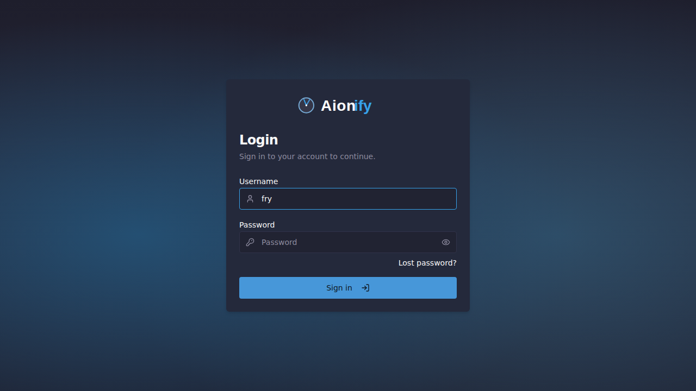
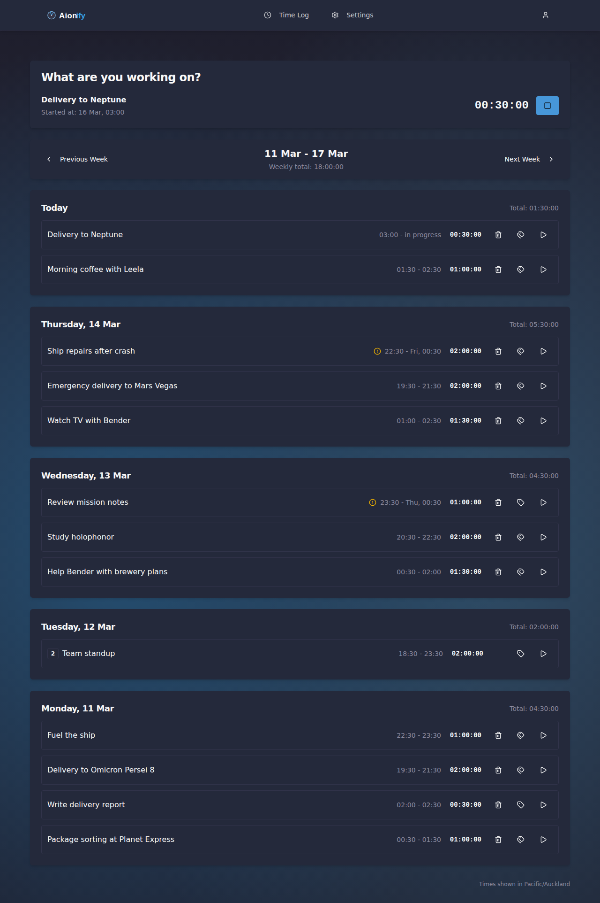
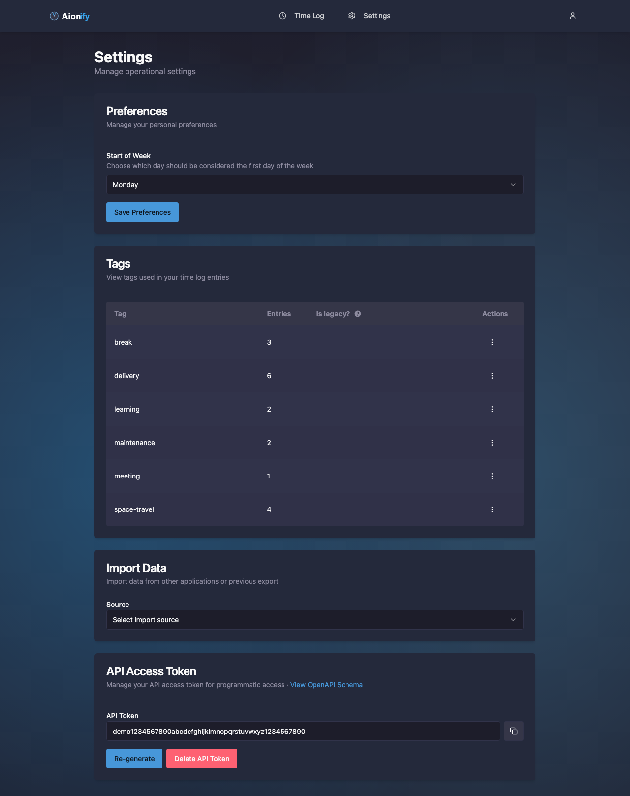

# Aionify

Self-hosted time tracking application for individuals and teams.

## Screenshots

### Login

### Time Tracking
Track your time with an intuitive interface showing active tasks and weekly view grouped by days.

### User Management (Admin)
Manage users, create accounts, and handle activation tokens.

### Settings
View tag usage statistics and manage your API access token for programmatic access.

### User Profile
Manage your profile, language preferences, and password.

## Features

### For Regular Users

- **Time Tracking**
  - Start, stop, and continue time entries
  - Edit existing time entries (title, start/end times, tags)
  - Delete time entries
  - View current active entry with live duration
  - Automatic prevention of overlapping entries

- **Time Log Management**
  - Weekly and daily view of time entries
  - Week navigation with customizable start day
  - Grouped display by day with daily totals
  - Weekly summary with total hours tracked

- **Tags and Organization**
  - Add multiple tags to time entries
  - View tag usage statistics
  - Mark tags as legacy to hide from suggestions
  - Tag-based filtering and organization

- **Smart Features**
  - Autocomplete suggestions based on previous entries
  - Intelligent search across entry titles and tags
  - Copy title and tags from previous entries

- **Data Import**
  - Import time entries from Toggl CSV exports
  - Automatic timezone handling during import

- **Personalization**
  - Customizable user greeting
  - Multi-language support (English and Ukrainian)
  - Configurable start of week (Monday/Sunday)
  - Dark mode compatible UI

- **API Integration**
  - Generate and manage personal API access tokens
  - Full programmatic access via REST API
  - Rate limiting protection

- **Browser Integrations**
  - Tampermonkey scripts for GitHub issues and pull requests
  - Tampermonkey scripts for Jira issues
  - Automatic time tracking start/stop from web pages
  - Smart metadata linking to issues/PRs

### For Administrators

- **All Regular User Features**
- **User Management**
  - Create new user accounts with secure activation tokens
  - View all users in the system with pagination
  - Edit user usernames
  - Delete user accounts (except own admin account)
  - Prevent self-deletion for security

- **User Onboarding**
  - Secure activation token system (10-day expiration)
  - Regenerate activation tokens for users
  - Password reset via token regeneration
  - Automatic default admin user creation on first startup

- **System Administration**
  - Admin portal access
  - User role management (admin vs regular users)
  - System security monitoring

## Quick Start

See [Deployment Guide](docs/deployment.md) for production deployment instructions.

See [Copilot Instructions](.github/copilot-instructions.md) for development guidelines.

## Documentation

- [Deployment Guide](docs/deployment.md) - How to deploy and configure the application
- [Administration Guide](docs/administration.md) - User management and administration
- [Public API Guide](docs/public-api.md) - Programmatic access via REST API
- [Browser Integrations Guide](docs/browser-integrations.md) - Tampermonkey scripts for GitHub and Jira
- [Internationalization Guide](docs/i18n.md) - Working with translations
- [Copilot Instructions](.github/copilot-instructions.md) - Development guidelines

## License

Apache License 2.0
