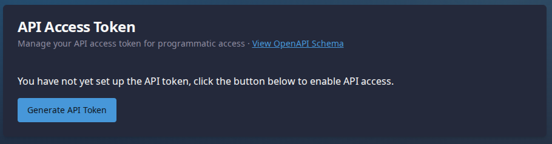
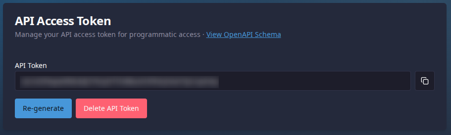

# Public API Guide

Aionify provides a public API for programmatic access to time tracking functionality. This guide explains how to authenticate and use the API.

## API Schema

The complete OpenAPI schema is available at:

```
https://your-aionify-instance.com/api/schema
```

The schema endpoint does not require authentication and provides detailed documentation of all available endpoints, request/response formats, and error codes.

## Authentication

All API endpoints (except `/api/schema`) require authentication using Bearer tokens.

### Generating an API Token

1. Log in to your Aionify account
2. Click on the **Settings** icon (⚙️) in the navigation bar
3. Scroll down to the **API Access Token** section
4. Click the **Generate Token** button (or **Regenerate Token** if you already have one)



5. Click the **eye icon** (👁️) to reveal the token
6. Click the **copy icon** (📋) to copy the token to your clipboard



**Important:**
- Store the token securely - it provides full access to your account
- Each user can have only one active API token
- Regenerating the token will invalidate the previous one
- If you delete the token, all API access will be denied

### Using the Token

Include the token in the `Authorization` header of your HTTP requests:

```bash
curl -H "Authorization: Bearer YOUR_API_TOKEN" \
  https://your-aionify-instance.com/api/time-log-entries/active
```

## Rate Limiting

To protect against brute force attacks, the API implements rate limiting:

- **10 failed authentication attempts** from the same IP address will result in a **10-minute block**
- Successful authentication clears the failed attempt counter
- When an IP is blocked, the API returns HTTP **429 (Too Many Requests)**

## API Endpoints

The complete API reference is available in the OpenAPI schema at `/api/schema`. Below is a brief overview:

### Available Endpoints

- **GET /api/time-log-entries/active** - Get the currently active time log entry
- **POST /api/time-log-entries/start** - Start a new time log entry
- **POST /api/time-log-entries/stop** - Stop the currently active time log entry

For detailed request/response formats, error codes, and examples, see the OpenAPI schema at:

```
https://your-aionify-instance.com/api/schema
```

## Metadata Format

The `metadata` field in API requests accepts an array of strings. The following conventions are used by browser integrations to match time entries to web pages:

- **GitHub Issues:** `gitHubIssue=owner/repo/number` (e.g., `gitHubIssue=facebook/react/12345`)
- **GitHub Pull Requests:** `gitHubPR=owner/repo/number` (e.g., `gitHubPR=facebook/react/12345`)
- **Jira Issues:** `jiraIssue=ISSUE-KEY` (e.g., `jiraIssue=PROJ-123`)
- **Custom Projects:** `project:name` (e.g., `project:aionify`)
- **Custom Tags:** `tag:value` (e.g., `tag:urgent`)

These conventions enable browser integration scripts (see [Browser Integrations Guide](./browser-integrations.md)) to automatically match time entries to the pages you're viewing.

You can use any metadata format for custom integrations.

## Examples

For detailed API usage examples including request/response formats, see the OpenAPI schema at `/api/schema`.

## Security Best Practices

1. **Never commit tokens to source control** - use environment variables or secure configuration
2. **Use HTTPS only** - never send tokens over unencrypted connections
3. **Rotate tokens regularly** - regenerate tokens periodically for security
4. **Monitor token usage** - watch for unexpected API calls in server logs
5. **Delete unused tokens** - remove tokens when they're no longer needed

## Further Reading

- [Browser Integrations Guide](./browser-integrations.md) - Tampermonkey scripts for GitHub and Jira
- [OpenAPI Schema](/api/schema) - Complete API documentation
